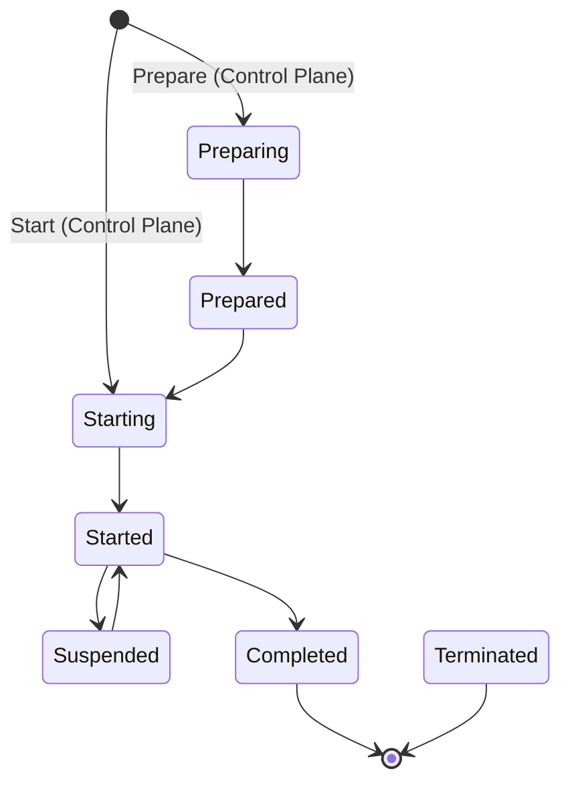
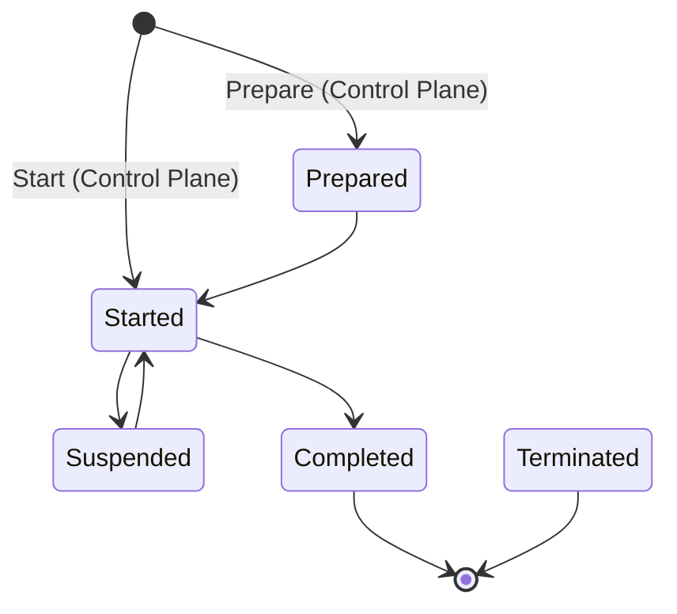
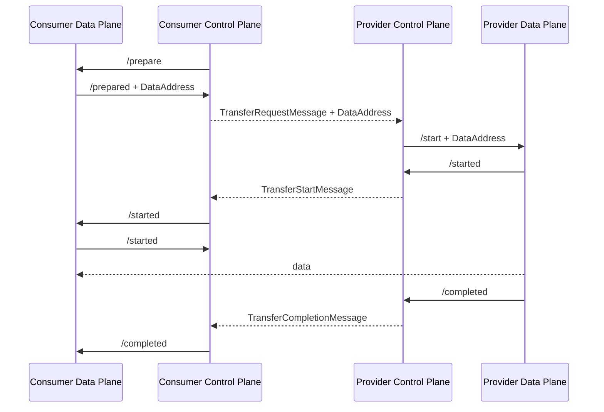
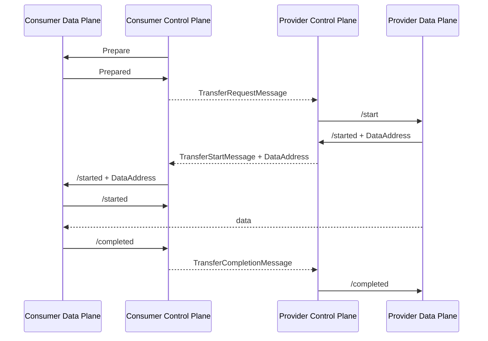
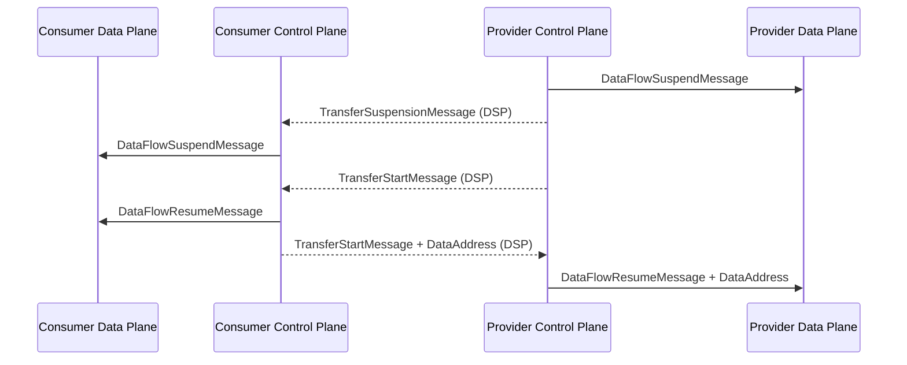
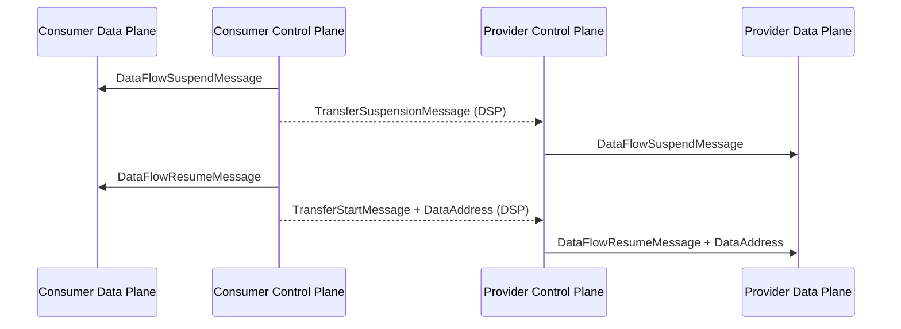
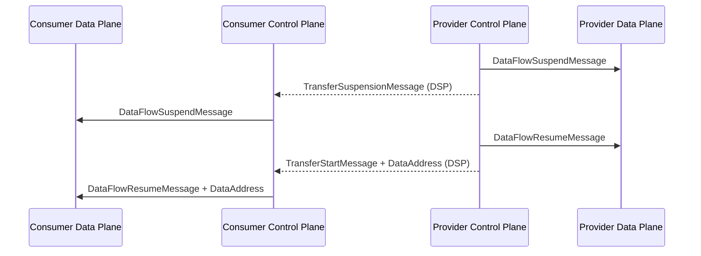
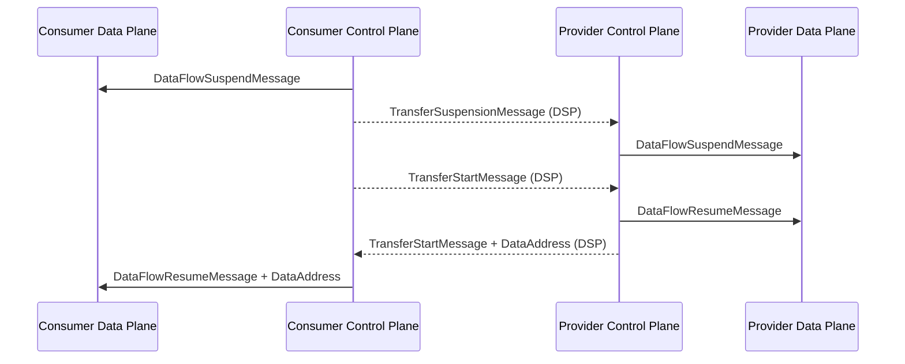
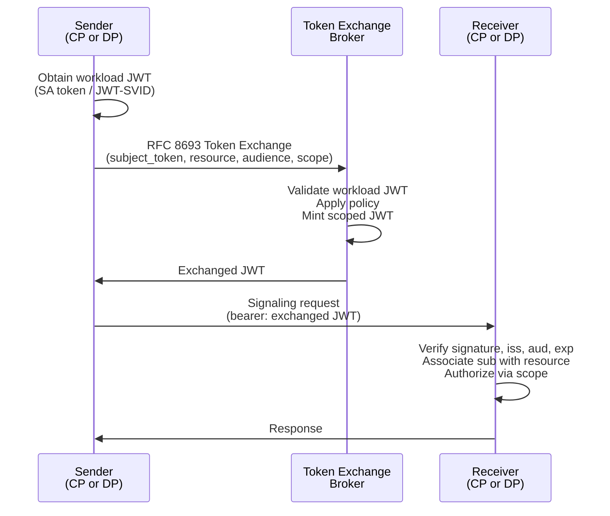

# Data Plane Signaling

Data Plane Signaling is an interoperable protocol and API used by connector control plane and data plane services to
execute data transfers. Its goal is to enable an ecosystem of compatible control plane and data plane implementations
that can be combined to meet the requirements of different dataspace use cases.

## Terminology

The following terms are used to describe concepts in this specification.

- <dfn>Connector</dfn>: Software services that manage the exchange of data between a provider and consumer as defined by
  the DSP Specification.
- <dfn>Control Plane</dfn>: The [=Connector=] services that implement the DSP protocol.
- <dfn>Data Flow</dfn>: The exchange of data belonging to a [=Dataset=] between a provider and consumer [=Data Plane=].
- <dfn>Data Plane</dfn>: The [=Connector=] services that implement a [=Data Flow=] using a [=Wire Protocol=].
- <dfn>Dataset</dfn>: Data or a technical service that can be shared as defined by the DSP Specification.
- <dfn>Participant</dfn>: A dataspace member as defined by the DSP Specification.
- <dfn>Transfer Process</dfn>: A set of interactions between two connectors that provide access to a dataset as defined
  by the DSP Specification.
- <dfn>Wire Protocol</dfn>: A protocol such as MQTT, AMQP, or an HTTP REST API that governs the exchange of data.

## Base Concepts

The DSP Specification models consumer access to a provider dataset in the [=Control Plane=] as
a [=Transfer Process=](https://eclipse-dataspace-protocol-base.github.io/DataspaceProtocol/2025-1/#dfn-transfer-process).
The
[=Wire Protocol=] operations in the [=Data Plane=] that facilitate data exchange are modeled as a [=Data Flow=]. A
[=Data Flow=] represents the current state of the physical data transfer.

### Data Transfer Types

A [=Data Flow=] is one of two data transfer types as defined in
the [DSP Specification](https://eclipse-dataspace-protocol-base.github.io/DataspaceProtocol/2025-1/#data-transfer-types):

| Push            | Pull              |
|-----------------|-------------------|
| Client Endpoint | Provider Endpoint |

Examples of push data transfers include an event stream published to a channel supplied by the consumer, or a file sent
to a consumer HTTP endpoint.

Examples of pull data transfers include an event stream that is published to a provider-supplied channel and accessed by
a consumer subscriber, or a provider HTTP REST API invoked by a consumer client.

#### Finite vs Non-Finite Data

DSP further
distinguishes [Finite and Non-Finite Data](https://eclipse-dataspace-protocol-base.github.io/DataspaceProtocol/2025-1/#finite-and-non-finite-data).
Finite data has a demarcated end, for example, a file or set of files. Non-Finite data has no specified end. It could be
an ongoing event stream or an HTTP REST API.

#### Back Channels

Some wire protocols may have the concept of a back channel. For example, a notification system implemented as an event
stream may have a reply queue for event consumers to provide response data. Back channels can exist for push or pull
transfer types. However, back channel endpoints are always supplied and managed by the provider.

## Data Flow State Machine

A [=Data Flow=] is defined as a state machine. [=Data Flow=] state transitions result in wire protocol operations.

### State Machine Definition

The [=Data Flow=] state machine is defined by the following states and transitions, which implementations MUST support:



Note: Any state can transition to `TERMINATED` (Not shown for simplicity)

[=Data Flow=] states are:

- **INITIALIZED**: The state machine has been initialized.
- **PREPARING**: A consumer data plane is in the process of preparing to receive or send data using a wire protocol.
  This process may involve provisioning resources such as access tokens or preparing data.
- **PREPARED**: The consumer is ready to receive or send data.
- **STARTING**: The consumer or provider is starting the wire protocol.
- **STARTED**: The consumer or provider has started sending data using the wire protocol.
- **SUSPENDED**: The data send operation is suspended.
- **COMPLETED**: The data send operation has completed normally. This is a terminal state.
- **TERMINATED**: The data send operation has terminated before completion. This is a terminal state.

Terminal states are final; the state machine MUST NOT transition to another state.

### Asynchronous Transitions

Under normal operation, a `prepare` request sent from the [=Control Plane=] to the [=Data Plane=] will result in the
state machine transitioning from its INITIALIZED state to PREPARED. Similarly, a start request will result in the state
machine transitioning from its INITIALIZED state to STARTED. These transitions MAY happen asynchronously to allow for
the efficient handling of long-running processes. All other transitions MUST be performed synchronously.

### Synchronous Operation

In many scenarios, a [=Data Plane=] MAY immediately transition from its INITIAL state to either the STARTED or PREPARED
state. In these cases, the transitions happen synchronously and can be represented in compact form as follows:



Note: Any state MAY transition to `TERMINATED` (Not shown for simplicity)

## Protocol Messaging

Data Plane Signaling messages are mapped to state machine transitions in the same way for push and pull data transfer
types. The difference lies in when [Data Addresses](#data-address) are transmitted.

### Data Address

A `DataAddress` conveys information to access a [=Wire Protocol=] endpoint. The `DataAddress` may contain an
authorization token. Implementations MUST support `DataAddress` serialization as defined by the DSP specification. The
following is a non-normative example of a `DataAddress`:

```json
{
  "endpointType": "https://w3id.org/idsa/v4.1/HTTP",
  "endpoint": "https://example.com",
  "endpointProperties": [
    {
      "name": "authorization",
      "value": "TOKEN-123"
    },
    {
      "name": "authType",
      "value": "bearer"
    }
  ]
}
```

### Push Protocol Messaging

A push transfer type uses a [=Wire protocol=] that allows a provider to send data to a consumer-supplied endpoint. This
requires the consumer control plane to issue a `prepare` request to the [=Data Plane=]. When the [=Data Plane=]
transitions to PREPARED, it will respond to the control plane with the `DataAddress` the provider [=Data Plane=] will
use to push data to the consumer. The complete [=Data Flow=] sequence is detailed below:



Note the transition to the PREPARED and STARTED states may be completed synchronously and returned as part of the
response to the consumer request. Or, the transitions may be completed asynchronously, and the response delivered as a
callback.

Note also, that the response signals (`/prepared`, `/started`, `/completed`) only occur
in [asynchronous transitions](#asynchronous-transitions). Implementations that
use [synchronous operations](#synchronous-operation) may simply return the appropriate HTTP success codes.

### Pull Protocol Messaging

The pull transfer type uses a wire protocol that allows the consumer to initiate the transfer by sending a request to a
provider endpoint. The flow is similar to the push type, except the `DataAddress` is generated by the
provider [=Data Plane=] as part of the transition to the STARTED state. The consumer [=Data Plane=] receives the
`DataAddress` from its control plane via a start message and can initiate the wire protocol. This sequence is
illustrated in the following diagram:



DSP messages are shown with a dotted line.

### Data Flow Suspension/Resumption

A STARTED Data Flow can be suspended at any time and resumed later. While a Data Flow is in the SUSPENDED state, no data
is transferred. The `resume` signal can only be triggered by the same party that initiated the `suspend` signal.

The following sequence diagrams illustrate the different flow types (PUSH and PULL) and identify whether the suspension
is initiated by the Provider or the Consumer:

#### Provider Push - Provider Suspend/Start



#### Provider Push - Consumer Suspend/Start



#### Consumer Pull - Provider Suspend/Start



#### Consumer Pull - Consumer Suspend/Start



## Data Flow API

The [=Data Flow=] API comprises separate [=Data Plane=] and [=Control Plane=] endpoints.

### Base URL

All endpoint URLs in this specification are relative. The base URL MUST use the HTTPS scheme. The base URL is
implementation-specific and may include additional context information such as a sub-path that indicates a version.

### Data Plane Endpoint

The Data Plane Endpoint is used by the [=Control Plane=] to manage [=Data Flows=].

#### Prepare

The `prepare` request signals to the [=Data Plane=] to initialize a [=Data Flow=] and any resources required for data
transfer. The request results in a state machine transition to PREPARING or PREPARED. If the state machine transitions
to PREPARING, the [=Data Plane=] MUST return HTTP 202 Accepted with the `Location` header set to
the [data flow status relative URL](#status) and a message body containing a `DataFlowStatusMessage`. If the state
machine transitions to PREPARED, the [=Data Plane=] MUST return HTTP 200 OK and a `DataFlowStatusMessage`.

|                 |                                                                                                                                                                       |
|-----------------|-----------------------------------------------------------------------------------------------------------------------------------------------------------------------|
| **HTTP Method** | `POST`                                                                                                                                                                |
| **URL Path**    | `/dataflows/prepare`                                                                                                                                                  |
| **Request**     | [`DataFlowPrepareMessage`](#dataflowpreparemessage)                                                                                                                   |
| **Response**    | `HTTP 200` with a [`DataFlowStatusMessage`](#dataflowstatusmessage) OR `HTTP 202` with a [`DataFlowStatusMessage`](#dataflowstatusmessage) OR `HTTP 4xx Client Error` |

##### DataFlowPrepareMessage

|               |                                                                                                                        |
|---------------|------------------------------------------------------------------------------------------------------------------------|
| **Schema**    | [JSON Schema](./schemas/DataFlowPrepareMessage.schema.json)                                                            |
| **Required**  | - `messageId`: A unique identifier for the message.                                                                    |
|               | - `participantId`: The participant ID of the sender as specified in the Dataspace Protocol.                            |
|               | - `counterPartyId`: The participant ID of the counterparty as specified in the Dataspace Protocol.                     |
|               | - `dataspaceContext`: An identifier for the dataspace context for when the data plane is used in multiple data spaces. |
|               | - `processId`: The transfer process ID as assigned by the control plane for correlation.                               |
|               | - `agreementId`: The contract agreement ID that was negotiated by the control plane.                                   |
|               | - `datasetId`: The ID of the dataset in the DCAT Catalog which is to be transferred.                                   |
|               | - `callbackAddress`: A URL where the control plane receives callbacks.                                                 |
|               | - `transferType`: The type of data transfer. See [data transfer types](#data-transfer-types).                          |
|               | - `claims`: An object containing the DSP claims of the counterparty as verified by the control plane.                  |
| **Optional**: | - `labels`: an array of strings that represent different flavours of data flow                                         |
|               | - `metadata`: An object containing information that could be used by the data plane during preparation.                |

The following is a non-normative example of a `DataFlowPrepareMessage`:

```json
{
  "messageId": "b1d5f9e2-3c4b-4f7a-9c3e-2f1e5d6c7b8a",
  "participantId": "provider-participant-id",
  "counterPartyId": "consumer-participant-id",
  "dataspaceContext": "test-dataspace-context",
  "processId": "test-transfer-process-id",
  "agreementId": "test-agreement-id",
  "datasetId": "asset-id",
  "callbackAddress": "https://example.com/provider/callback",
  "transferType": "https://w3id.org/dspace-sig/profile/s3-push",
  "claims": {
    "membership": "active",
    "sub": "subject"
  },
  "labels": [
    "gold",
    "blue"
  ],
  "metadata": {
    "bucketName": "destinationBucket",
    "region": "westeurope",
    "...": "..."
  }
}
```

##### DataFlowStatusMessage

|              |                                                                                                                                     |
|--------------|-------------------------------------------------------------------------------------------------------------------------------------|
| **Schema**   | [JSON Schema](./schemas/DataFlowStatusMessage.schema.json)                                                                          |
| **Required** | - `messageId`: A unique identifier for the message.                                                                                 |
|              | - `dataFlowId`: The unique identifier of the data flow.                                                                             |
|              | - `state`: The current state of the data flow.                                                                                      |
| **Optional** | - `dataAddress`: An object containing information about where the data can be obtained/provided. See [data address](#data-address). |
|              | - `error`: A description of any error that occurred during processing.                                                              |

The following is a non-normative example of a `DataFlowStatusMessage`:

```json
{
  "messageId": "b1d5f9e2-3c4b-4f7a-9c3e-2f1e5d6c7b8a",
  "dataFlowId": "dataFlow-123",
  "dataAddress": {},
  "state": "PREPARED",
  "error": ""
}
```

#### Start

The `start` request signals to the provider [=Data Plane=] to begin a data transfer. The request results in a state
machine transition to STARTING or STARTED. If the state machine transitions to STARTING, the [=Data Plane=] MUST return
HTTP 202 Accepted with the `Location` header set to the [data flow status relative URL](#status) and a message body
containing a
`DataFlowStatusMessage`. If the state machine transitions to STARTED, the [=Data Plane=] MUST return HTTP 200 OK and a
`DataFlowStatusMessage`.

|                 |                                                                                                                                                                        |
|-----------------|------------------------------------------------------------------------------------------------------------------------------------------------------------------------|
| **HTTP Method** | `POST`                                                                                                                                                                 |
| **URL Path**    | `/dataflows/start`                                                                                                                                                     |
| **Request**     | [`DataFlowStartMessage`](#dataflowstartmessage)                                                                                                                        |
| **Response**    | `HTTP 200` with a [`DataFlowStatusMessage`](#dataflowstatusmessage) OR `HTTP 202` with a [`DataFlowStatusMessage`](#dataflowstatusmessage) OR `HTTP 4xx Client Error`. |

##### DataFlowStartMessage

|              |                                                                                                                                                                                             |
|--------------|---------------------------------------------------------------------------------------------------------------------------------------------------------------------------------------------|
| **Schema**   | [JSON Schema](./schemas/DataFlowStartMessage.schema.json)                                                                                                                                   |
| **Required** | - `messageId`: A unique identifier for the message.                                                                                                                                         |
|              | - `participantId`: The participant ID of the sender as specified in the Dataspace Protocol.                                                                                                 |
|              | - `counterPartyId`: The participant ID of the counterparty as specified in the Dataspace Protocol.                                                                                          |
|              | - `dataspaceContext`: An identifier for the dataspace context for when the data plane is used in multiple data spaces.                                                                      |
|              | - `processId`: The transfer process ID as assigned by the control plane for correlation.                                                                                                    |
|              | - `agreementId`: The contract agreement ID that was negotiated by the control plane.                                                                                                        |
|              | - `datasetId`: The ID of the dataset in the DCAT Catalog which is to be transferred.                                                                                                        |
|              | - `callbackAddress`: A URL where the control plane receives callbacks.                                                                                                                      |
|              | - `transferType`: The type of data transfer. See [data transfer types](#data-transfer-types).                                                                                               |
|              | - `claims`: An object containing the DSP claims of the counterparty as verified by the control plane.                                                                                       |
| **Optional** | - `dataAddress`: An object containing information about where the provider should push data (provider push). Must be omitted on consumer pull transfers. See [data address](#data-address). |
|              | - `labels`: an array of strings that represent different flavours of data flow                                                                                                              |
|              | - `metadata`: An object containing information that could be used by the data plane during startup.                                                                                         |

If a data flow already exists for a particular `processId` the [=Data Plane=] MUST respond with HTTP 4xx Client Error.
For consumer pull transfers, supplying a data address with the `/start` signal MUST result in a HTTP 4xx Client Error.

The following is a non-normative example of a `DataFlowStartMessage` where the data is located in an internal API of the
provider and must be accessed by the provider data plane using an API Key:

```json
{
  "messageId": "b1d5f9e2-3c4b-4f7a-9c3e-2f1e5d6c7b8a",
  "participantId": "provider-participant-id",
  "counterPartyId": "consumer-participant-id",
  "dataspaceContext": "test-dataspace-context",
  "processId": "test-transfer-process-id",
  "agreementId": "test-agreement-id",
  "datasetId": "asset-id",
  "callbackAddress": "https://example.com/provider/callback",
  "transferType": "https://w3id.org/dspace-sig/profile/http-pull",
  "claims": {
    "membership": "active",
    "sub": "subject"
  },
  "dataAddress": {
    "endpointType": "https://w3id.org/idsa/v4.1/HTTP",
    "endpoint": "http://dataplane.provider.com/api/public",
    "endpointProperties": [
      {
        "name": "authorization",
        "value": "<AUTH_TOKEN>"
      },
      {
        "name": "authType",
        "value": "bearer"
      }
    ]
  },
  "labels": [
    "gold",
    "blue"
  ],
  "metadata": {
    "bucketName": "sourceBucket",
    "region": "westeurope",
    "...": "..."
  }
}
```

#### Started Notification

The `started` request signals to the consumer [=Data Plane=] that a data transmission has begun and that
a [state transition](#data-flow-state-machine) should be triggered. For pull transfers, this indicates the
consumer [=Data Plane=] may fetch data. For push transfers, this indicates the provider has already started sending
data. The request results in a state machine transition to STARTED, and the [=Data Plane=] MUST return HTTP 200 OK.

This signal occurs exclusively on the consumer side.

|                 |                                                                             |
|-----------------|-----------------------------------------------------------------------------|
| **HTTP Method** | `POST`                                                                      |
| **URL Path**    | `/dataflows/:id/started`                                                    |
| **Request**     | [`DataFlowStartedNotificationMessage`](#dataflowstartednotificationmessage) |
| **Response**    | `HTTP 200` OR `HTTP 4xx Client Error`.                                      |

##### DataFlowStartedNotificationMessage

|              |                                                                                                                                                                              |
|--------------|------------------------------------------------------------------------------------------------------------------------------------------------------------------------------|
| **Schema**   | [JSON Schema](./schemas/DataFlowStartedNotificationMessage.schema.json)                                                                                                      |
| **Required** | - `messageId`: A unique identifier for the message.                                                                                                                          |
| **Optional** | - `dataAddress`: A [DataAddress](#data-address) that contains information about where the data can be obtained (consumer-pull). Must be omitted for provider-push transfers. |

The following is a non-normative example of a `DataFlowStartedNotificationMessage`:

```json
{
  "messageId": "b1d5f9e2-3c4b-4f7a-9c3e-2f1e5d6c7b8a",
  "dataAddress": {
    "endpointType": "https://w3id.org/idsa/v4.1/HTTP",
    "endpoint": "http://dataplane.provider.com/api/public",
    "endpointProperties": [
      {
        "name": "authorization",
        "value": "<AUTH_TOKEN>"
      },
      {
        "name": "authType",
        "value": "bearer"
      }
    ]
  }
}
```

> Implementation notice: in provider-push transfers, the consumer [=Data Plane=] SHOULD be ready to receive data after
> the response to the `/prepare` has been sent. This is due to the fact, that the subsequent `/start` signal on the
> provider data plane happens after `/prepare`, but before `/:id/started`, and the provider data plane MAY already have
> started sending data at that time.

#### Suspend

The `suspend` request signals to the [=Data Plane=] to suspend a data transfer.

|                 |                                                     |
|-----------------|-----------------------------------------------------|
| **HTTP Method** | `POST`                                              |
| **URL Path**    | `/dataflows/:id/suspend`                            |
| **Request**     | [`DataFlowSuspendMessage`](#dataflowsuspendmessage) |
| **Response**    | `HTTP 200` OR `HTTP 4xx Client Error`               |

##### DataFlowSuspendMessage

|              |                                                                       |
|--------------|-----------------------------------------------------------------------|
| **Schema**   | [JSON Schema](./schemas/DataFlowSuspendMessage.schema.json)           |
| **Required** | - `messageId`: A unique identifier for the message.                   |
| **Optional** | - `reason`: A description of the reason for suspending the data flow. |

The following is a non-normative example of a `DataFlowSuspendMessage`:

```json
{
  "messageId": "b1d5f9e2-3c4b-4f7a-9c3e-2f1e5d6c7b8a",
  "reason": "Suspending data flow due to scheduled maintenance."
}
```

#### Resume

The `resume` request signals to the [=Data Plane=] to resume a data transfer.

|                 |                                                                                                |
|-----------------|------------------------------------------------------------------------------------------------|
| **HTTP Method** | `POST`                                                                                         |
| **URL Path**    | `/dataflows/:id/resume`                                                                        |
| **Request**     | [`DataFlowResumeMessage`](#dataflowresumemessage)                                              |
| **Response**    | `HTTP 200` with a [`DataFlowStatusMessage`](#dataflowstatusmessage) OR `HTTP 4xx Client Error` |

##### DataFlowResumeMessage

|              |                                                                                                                          |
|--------------|--------------------------------------------------------------------------------------------------------------------------|
| **Schema**   | [JSON Schema](./schemas/DataFlowResumeMessage.schema.json)                                                               |
| **Required** | - `messageId`: A unique identifier for the message.                                                                      |
| **Optional** | - `dataAddress`: A [DataAddress](#data-address) that contains information about where the data can be obtained/provided. |

The following is a non-normative example of a `DataFlowResumeMessage`:

```json
{
  "messageId": "b1d5f9e2-3c4b-4f7a-9c3e-2f1e5d6c7b8a",
  "dataAddress": {}
}
```

#### Terminate

The `terminate` request signals to the [=Data Plane=] to terminate a data transfer.

|                 |                                                         |
|-----------------|---------------------------------------------------------|
| **HTTP Method** | `POST`                                                  |
| **URL Path**    | `/dataflows/:id/terminate`                              |
| **Request**     | [`DataFlowTerminateMessage`](#dataflowterminatemessage) |
| **Response**    | `HTTP 200` OR `HTTP 4xx Client Error`                   |

##### DataFlowTerminateMessage

|              |                                                                        |
|--------------|------------------------------------------------------------------------|
| **Schema**   | [JSON Schema](./schemas/DataFlowTerminateMessage.schema.json)          |
| **Required** | - `messageId`: A unique identifier for the message.                    |
| **Optional** | - `reason`: A description of the reason for terminating the data flow. |

The following is a non-normative example of a `DataFlowTerminateMessage`:

```json
{
  "messageId": "b1d5f9e2-3c4b-4f7a-9c3e-2f1e5d6c7b8a",
  "reason": "Terminating data flow due to an unrecoverable error."
}
```

#### Completed

The `completed` request signals to the [=Data Plane=] that a data transmission has completed normally. For consumer pull
transmissions, the `completed` request is sent to the provider data plane. For provider push transmissions the
`completed`
signal is sent to the consumer data plane.

|                 |                                       |
|-----------------|---------------------------------------|
| **HTTP Method** | `POST`                                |
| **URL Path**    | `/dataflows/:id/completed`            |
| **Request**     | Empty body                            |
| **Response**    | `HTTP 200` OR `HTTP 4xx Client Error` |

#### Status

The `status` request returns a representation of the [=Data Flow=].

|                 |                                                                                                                |
|-----------------|----------------------------------------------------------------------------------------------------------------|
| **HTTP Method** | `GET`                                                                                                          |
| **URL Path**    | `/dataflows/:id/status`                                                                                        |
| **Request**     | Empty body                                                                                                     |
| **Response**    | `HTTP 200` with a [`DataFlowStatusResponseMessage`](#dataflowstatusresponsemessage) OR `HTTP 4xx Client Error` |

##### DataFlowStatusResponseMessage

|              |                                                                    |
|--------------|--------------------------------------------------------------------|
| **Schema**   | [JSON Schema](./schemas/DataFlowStatusResponseMessage.schema.json) |
| **Required** | - `dataFlowId`: The unique identifier of the data flow.            |
|              | - `state`: The current state of the data flow.                     |

The following is a non-normative example of a `DataFlowStatusResponseMessage`:

```json
{
  "dataFlowId": "dataFlow-123",
  "state": "STARTED"
}
```

### Control Plane Endpoint

The Control Plane Endpoint is used by the [=Data Plane=] to make state transition callbacks.

#### Prepared

The `prepared` request signals to the [=Control Plane=] that the [=Data Flow=] is in the PREPARED state.

|                 |                                                   |
|-----------------|---------------------------------------------------|
| **HTTP Method** | `POST`                                            |
| **URL Path**    | `/transfers/:transferId/dataflow/prepared`        |
| **Request**     | [`DataFlowStatusMessage`](#dataflowstatusmessage) |
| **Response**    | `HTTP 200` OR `HTTP 4xx Client Error`             |

#### Started

The `started` request signals to the [=Control Plane=] that the [=Data Flow=] is in the STARTED state.

|                 |                                                   |
|-----------------|---------------------------------------------------|
| **HTTP Method** | `POST`                                            |
| **URL Path**    | `/transfers/:transferId/dataflow/started`         |
| **Request**     | [`DataFlowStatusMessage`](#dataflowstatusmessage) |
| **Response**    | `HTTP 200` OR `HTTP 4xx Client Error`             |

#### Completed

The `completed` request signals to the [=Control Plane=] that the [=Data Flow=] is in the COMPLETED state.

|                 |                                                   |
|-----------------|---------------------------------------------------|
| **HTTP Method** | `POST`                                            |
| **URL Path**    | `/transfers/:transferId/dataflow/completed`       |
| **Request**     | [`DataFlowStatusMessage`](#dataflowstatusmessage) |
| **Response**    | `HTTP 200` OR `HTTP 4xx Client Error`             |

#### Errored

The `errored` request notifies the [=Control Plane=] that a non-recoverable error has occurred at the [=Wire Protocol=]
layer. This request does not cause a state transition. The [=Control Plane=] MUST NOT propagate this event to the
counterparty. Instead, the [=Control Plane=] must independently decide how to recover: through operator intervention,
restarting the transfer process, or creating a new transfer.

Note that only terminal, non-recoverable errors should be reported to the [=Control Plane=]. Transient errors should be
handled by the [=Data Plane=].

NOTE: A `terminated` request does not exist because direct termination signaling from the [=Data Plane=] to the
[=Control Plane=] would create conflicting dual-termination scenarios. For example, if a provider data plane terminates
due to a policy violation and closes the socket, the consumer data plane may independently detect this as a wire
protocol error and send an `errored` message. Since these terminations cannot be correlated, propagating both as
TERMINATED events would violate the DSP constraint that a transfer process cannot transition from TERMINATED to
TERMINATED. [=Wire Protocol=] specifications MUST define what constitutes abnormal termination; for example, a socket
close without a prior terminated message may be interpreted as an error, while a terminated message followed by a socket
close is not.

|                 |                                           |
|-----------------|-------------------------------------------|
| **HTTP Method** | `POST`                                    |
| **URL Path**    | `/transfers/:transferId/dataflow/errored` |
| **Request**     | [`DataFlowStatusMessage`]                 |
| **Response**    | `HTTP 200` OR `HTTP 4xx Client Error`     |

#### Agreement retrieval

The [=Data Plane=] MAY request the [=Control Plane=] for the agreement that is associated with the transfer.

|                 |                                                                                       |
|-----------------|---------------------------------------------------------------------------------------|
| **HTTP Method** | `GET`                                                                                 |
| **URL Path**    | `/transfers/:transferId/agreement`                                                    |
| **Request**     |                                                                                       |
| **Response**    | `HTTP 200` with an [AgreementResponse](#agreementresponse) OR `HTTP 4xx Client Error` |

##### AgreementResponse

|            |                                                        |
|------------|--------------------------------------------------------|
| **Schema** | [JSON Schema](./schemas/AgreementResponse.schema.json) |

Note that the agreement response schema reuses the `Agreement` schema definition as specified in the DSP.

## Registration

Registration is the process where a [=Data Plane=] is registered with the [=Control Plane=] and vice versa. Registration
may be performed through configuration, via an endpoint, or both. This section describes the registration process for
both [=Data Plane=] and [=Control Plane=] deployments.

Registration may be performed multiple times to update information. Updates follow `replace` semantics. Authorization
key rotation can be achieved by updating registrations.

Since the Data Plane Signaling API is bidirectional, security should be enforced on both the [=Control Plane=] and
[=Data Plane=]. This can be achieved at the networking layer or by using a mutual authorization profile. The
registration process is designed to convey data required to bootstrap authorization.

Note that the registration process granularity is not defined by this specification and is implementation-specific. For
example, a registration may be per deployment or per participant in a multi-participant deployment.

### Data Plane Registration

Data Plane registration is the process where a [=Data Plane=] is registered with the [=Control Plane=].

#### The Data Plane Registration Message

The data plane registration message object contains the following properties:

|              |                                                                                                     |
|--------------|-----------------------------------------------------------------------------------------------------|
| **Schema**   | [JSON Schema](./schemas/DataPlaneRegistrationMessage.schema.json)                                   |
| **Required** | - `dataplaneId`: the data plane id                                                                  |
|              | - `endpoint`: The data plane signaling endpoint.                                                    |
|              | - `transferTypes`: An array of one or more strings corresponding to supported transfer types.       |
| **Optional** | - `authorization`: an authorization object.                                                         |
|              | - `labels`: an array of one or more strings corresponding to labels associated with the data plane. |

The following is a non-normative example of a Data Plane registration data object:

```json
{
  "dataplaneId": "7d6fda82-98b6-4738-a874-1f2c003a79ff",
  "endpoint": "https://example.com/signaling",
  "transferTypes": [
    "https://w3id.org/dspace-sig/profile/http-pull"
  ],
  "authorization": {
    "type": "..."
  },
  "labels": [
    "label1",
    "label2"
  ]
}
```

##### Transfer Types

Note that standardization of the transfer types is not in the scope of this specification. Dataspaces may define
specific transfer types.

##### Authorization Object

The authorization object contains one mandatory property, `type`, which identifies a supported Authorization Profile,
and MAY include additional properties specific to that profile.

#### Configuration-based Registration

A [=Control Plane=] implementation MAY support registration through configuration. In this scenario, the way
configuration is applied is implementation-specific.

#### Registration and update endpoint

A [=Control Plane=] implementation MAY support registration through an endpoint. The endpoint is defined as follows:

|                 |                                       |
|-----------------|---------------------------------------|
| **HTTP Method** | `PUT`                                 |
| **URL Path**    | `/dataplanes`                         |
| **Request**     | [`DataPlaneRegistrationMessage`]      |
| **Response**    | `HTTP 200` OR `HTTP 4xx Client Error` |

The `DataPlaneRegistrationMessage` adheres to the [Registration type](#the-data-plane-registration-message)
structure. The endpoint MAY require an authorization mechanism such as OAuth 2.0 or API Key. This is
implementation-specific.

Note that the endpoint is relative and may include additional context information, such as a subpath indicating the
participant ID to which the registration applies or the API version.

Subsequent calls to this endpoint with the same `dataplaneId` will update the registration.

##### Deletion

If the [=Control Plane=] implementation supports endpoint registration, it MUST support endpoint deletion defined as
follows:

|                 |                                       |
|-----------------|---------------------------------------|
| **HTTP Method** | `DELETE`                              |
| **URL Path**    | `/dataplanes/:dataplaneId`            |
| **Response**    | `HTTP 204` OR `HTTP 4xx Client Error` |

### Control Plane Registration

Control Plane registration is the process where a [=Control Plane=] is registered with the [=Data Plane=].

#### The Control Plane Registration Type

The control plane registration object contains the following properties:

|              |                                                                      |
|--------------|----------------------------------------------------------------------|
| **Schema**   | [JSON Schema](./schemas/ControlPlaneRegistrationMessage.schema.json) |
| **Required** | - `controlplaneId`: the control plane id                             |
| **Optional** | - `authorization`: an authorization object.                          |

The following is a non-normative example of a Control Plane registration data object:

```json
{
  "controlplaneId": "bcf2d204-03bc-4354-8e92-b15b68d3c358",
  "endpoint": "https://example.com/signaling",
  "authorization": {
    "type": "..."
  }
}
```

##### Authorization Object

The authorization object contains one mandatory property, `type`, which identifies a supported Authorization Profile,
and MAY include additional properties specific to that profile.

#### Configuration-based Registration

A [=Data Plane=] implementation MAY support registration through configuration. In this scenario, the way configuration
is applied is implementation-specific.

#### Endpoint Registration

A [=Data Plane=] implementation MAY support registration through an endpoint. The endpoint is defined as follows:

|                 |                                       |
|-----------------|---------------------------------------|
| **HTTP Method** | `PUT`                                 |
| **URL Path**    | `/controlplanes`                      |
| **Request**     | [`ControlPlaneRegistrationMessage`]   |
| **Response**    | `HTTP 200` OR `HTTP 4xx Client Error` |

The `ControlPlaneRegistrationMessage` adheres to the [Registration type](#the-control-plane-registration-type)structure.
The endpoint MAY require an authorization mechanism such as OAuth 2.0 or API Key. This is implementation-specific.

Note that the endpoint is relative and may include additional context information, such as a subpath indicating the
participant ID to which the registration applies.

Subsequent calls of this endpoint with the same `controlplaneId` will update the registration.

##### Deletion

If the [=Data Plane=] implementation supports endpoint registration, it MUST support endpoint deletion defined as
follows:

|                 |                                       |
|-----------------|---------------------------------------|
| **HTTP Method** | `DELETE`                              |
| **URL Path**    | `/controlplanes/:controlplaneId`      |
| **Response**    | `HTTP 204` OR `HTTP 4xx Client Error` |

### Authorization Profiles

This section describes Authorization Profiles that can be used to authorize a [=Data Plane=] or [=Control Plane=]
registration. Implementations SHOULD use one of these profiles to ensure minimum interoperability and avoid defining 
custom authorization profiles. All Authorization Profiles are optional and not mandatory.

#### OAuth 2 Client Credentials Grant

A [=Control Plane=] or [=Data Plane=] that supports the OAuth 2.0 Client Credentials Grant as is defined
in [RFC 6749](https://tools.ietf.org/html/rfc6749#section-4.4) uses an `oauth2_client_credentials` authorization profile
in its `authorization` object. This object contains the following properties:

|              |                                                                                                                                                                                          |
|--------------|------------------------------------------------------------------------------------------------------------------------------------------------------------------------------------------|
| **Schema**   | [JSON Schema](./resources/TBD)                                                                                                                                                           |
| **Required** | - `type`: Must be `oauth2_client_credentials`.                                                                                                                                           |
|              | - `tokenEndpoint`: The URL of the authorization server's token endpoint as defined in [RFC6749](https://datatracker.ietf.org/doc/html/rfc6749).                                          |
|              | - `clientId`: The OAuth2 client id used for the Client Credentials Grant.                                                                                                                |
|              | - `clientSecret`: The OAuth2 client secret used for the Client Credentials Grant.                                                                                                        |
| **Optional** | - `jwks`: A JSON Web Key Set ([RFC7517](https://datatracker.ietf.org/doc/html/rfc7517)) containing the public key(s) the receiving party MUST use to verify tokens issued by this party. |
|              | - `jwksUri`: A URL pointing to a JSON Web Key Set endpoint. The receiving party MAY fetch and cache the JWKS from this URL to verify tokens issued by this party.                        |

The way `jwks` and `jwksUri` are managed is implementation specific, but generally speaking they should never used at
the same time. If neither is provided, the receiving party skips signature verification. When a JWKS is present, the
receiving party MUST use the key whose `kid` matches the `kid` header claim of the incoming JWT. If no `kid` is present,
the receiving party MAY attempt verification with each key in the set.

The following is a non-normative example of an OAuth2 entry using an inline JWKS:

```json
{
  "authorization": {
    "type": "oauth2_client_credentials",
    "tokenEndpoint": "https://example.com/auth",
    "clientId": "1234567890",
    "clientSecret": "1234567890",
    "jwks": {
      "keys": [
        {
          "kty": "RSA",
          "kid": "key-2025-04",
          "use": "sig",
          "n": "...",
          "e": "AQAB"
        }
      ]
    }
  }
}
```

The following is a non-normative example using a JWKS URI:

```json
{
  "authorization": {
    "type": "oauth2_client_credentials",
    "tokenEndpoint": "https://example.com/auth",
    "clientId": "1234567890",
    "clientSecret": "1234567890",
    "jwksUri": "https://example.com/auth/.well-known/jwks.json"
  }
}
```

##### Token Claims

Access tokens obtained via the Client Credentials Grant are self-signed JWTs. The issuing party signs the token with its
own private key. If a `jwks` or `jwksUri` was provided during registration, the receiving party MUST verify the token
signature using those public key (s). Otherwise, signature verification is skipped and verification is based solely on
the claims contained in the token.

The access token MUST be a JWT and MUST contain the following claims:

| Claim | Requirement | Description                                                                                                                                                            |
|-------|-------------|------------------------------------------------------------------------------------------------------------------------------------------------------------------------|
| `iss` | MUST        | Issuer of the token                                                                                                                                                    |
| `sub` | MUST        | The identifier of the issuing party. For a [=Data Plane=] token this MUST equal the `dataplaneId`; for a [=Control Plane=] token this MUST equal the `controlplaneId`. |
| `aud` | MUST        | The identifier of the target plane receiving the token.                                                                                                                |
| `iat` | MUST        | The time at which the token was issued (seconds since Unix epoch).                                                                                                     |
| `exp` | MUST        | The expiration time of the token (seconds since Unix epoch). Receiving parties MUST reject expired tokens.                                                             |
| `jti` | SHOULD      | A unique token identifier. Receiving parties SHOULD use this to detect and reject token replay attempts.                                                               |


#### OAuth 2 Token Exchange

A [=Control Plane=] or [=Data Plane=] that obtains access tokens by exchanging a workload-layer credential (for example
a Kubernetes ServiceAccount token or a SPIFFE JWT-SVID) for a scoped JWT, as defined in
[RFC 8693](https://datatracker.ietf.org/doc/html/rfc8693), uses an `oauth2_token_exchange` authorization profile in its
`authorization` object.

This profile is positioned for deployments where the issuing party does not run a self-signing authorization server.
Instead, a **token exchange broker** validates a workload-layer credential, applies policy to map it to a
signaling-layer principal, and mints a scoped JWT that the issuing party presents to the receiving party. The
workload-layer credential never travels to the receiving party.

The `authorization` object contains the following properties:

|              |                                                                                                                                                                                                                                         |
|--------------|-----------------------------------------------------------------------------------------------------------------------------------------------------------------------------------------------------------------------------------------|
| **Schema**   | [JSON Schema](./resources/TBD)                                                                                                                                                                                                          |
| **Required** | - `type`: Must be `oauth2_token_exchange`.                                                                                                                                                                                              |
|              | - `tokenExchangeEndpoint`: The URL of the broker's token exchange endpoint as defined in [RFC 8693](https://datatracker.ietf.org/doc/html/rfc8693).                                                                                     |
|              | - `issuer`: The expected `iss` claim of tokens minted by the broker. The receiving party MUST reject tokens whose `iss` does not match this value.                                                                                      |
|              | - `jwksUri`: A URL pointing to the broker's JSON Web Key Set ([RFC7517](https://datatracker.ietf.org/doc/html/rfc7517)) endpoint. The receiving party fetches and caches the JWKS from this URL to verify tokens issued by this broker. |

Inline JSON Web Key Sets are not permitted for this profile; the broker's keys MUST be served from `jwksUri`. The
receiving party MUST verify the signature of every incoming JWT against the keys obtained from `jwksUri`; signature
verification MUST NOT be skipped. The receiving party MUST use the key whose `kid` matches the `kid` header claim of the
incoming JWT. If no `kid` is present, the receiving party MAY attempt verification with each key in the set.

The `authorization` object does not carry the list of principals the issuing party may act as. The set of valid
principals is known to the receiving party out-of-band; the receiving party associates each incoming request with the
correct resource by reading the `sub` and `participant_context` claims of the presented JWT.

The following is a non-normative example using a JWKS URI:

```json
{
  "authorization": {
    "type": "oauth2_token_exchange",
    "metadataEndpoint": "https://broker.example.com/auth/.well-known/oauth-authorization-server"
  }
}
```

##### Principal Resource

A **Principal Resource** is a URI-named principal that an exchanged JWT speaks for. Defining it as a resource gives the
`sub` claim of exchanged JWTs agreed semantics across implementations.

A Principal Resource has the following normative properties:

|              |                                                                                                                                |
|--------------|--------------------------------------------------------------------------------------------------------------------------------|
| **Required** | - `id`: An absolute URI. The `sub` claim of any JWT exchanged for this principal MUST equal this URI verbatim.                 |
|              | - `participantContextId`: The participant context this principal acts within. Semantics are deferred to the participant layer. |

Implementations MAY attach additional properties (for example display metadata, allowed scopes, or constraints on which
workload identities may be exchanged for this principal); this specification does not constrain them. Only the `id`
crosses the wire, as the `sub` of the exchanged JWT.

The URI scheme of `id` is unconstrained. Implementations MAY use `urn:`, opaque `https:` URIs, or resolvable HTTP
endpoints. Whether the URI is dereferenceable is a deployment choice.

##### Workload Credential

The issuing party authenticates to the broker by presenting a **workload credential**: a JWT minted by the workload
runtime that proves the identity of the process performing the exchange. This specification defines two workload
credential types: Kubernetes ServiceAccount tokens and SPIFFE JWT-SVIDs. A broker MAY support either, both, or
additional workload credential types via implementation-specific extension.

A workload credential MUST be a JWT and MUST contain the following claims:

| Claim | Requirement | Description                                                                                                                                                                                                            |
|-------|-------------|------------------------------------------------------------------------------------------------------------------------------------------------------------------------------------------------------------------------|
| `iss` | MUST        | Issuer of the workload credential (the cluster OIDC issuer or SPIFFE trust domain authority).                                                                                                                          |
| `sub` | MUST        | The workload identity (for example a ServiceAccount subject or SPIFFE ID). The broker maps this value to a [Principal Resource](#principal-resource).                                                                  |
| `aud` | MUST        | MUST contain the broker's `tokenExchangeEndpoint` value, or another broker-designated audience identifier configured out-of-band. The broker MUST reject workload credentials whose `aud` does not include this value. |
| `exp` | MUST        | Expiration time. The broker MUST reject expired workload credentials.                                                                                                                                                  |

###### Kubernetes ServiceAccount Tokens

When the workload runs in Kubernetes, the workload credential is a
[projected ServiceAccount token](https://kubernetes.io/docs/concepts/configuration/secret/#service-account-token-secrets).
The token is obtained by mounting a `projected` volume of type `serviceAccountToken` with the `audience` field set to
the broker's audience identifier. The workload reads the token from the mounted path and presents it to the broker.

The `subject_token_type` for a Kubernetes ServiceAccount token is
`urn:ietf:params:oauth:token-type:jwt`. The token's `sub` claim takes the form
`system:serviceaccount:<namespace>:<serviceaccount>`, and its `iss` claim is the cluster's OIDC issuer URL.

###### SPIFFE JWT-SVIDs

When the workload is provisioned with a SPIFFE identity, the workload credential is a JWT-SVID obtained by calling
[`FetchJWTSVID`](https://github.com/spiffe/spiffe/blob/main/standards/SPIFFE_Workload_API.md) on the local SPIFFE
Workload API with the audience set to the broker's audience identifier.

The `subject_token_type` for a JWT-SVID is `urn:ietf:params:oauth:token-type:jwt`. The token's `sub` claim is the SPIFFE
ID (e.g. `spiffe://prod.acme/ns/dp/sa/data-plane`) and its `iss` claim is the SPIFFE trust domain authority.

##### Exchange Request

To obtain a scoped JWT, the issuing party performs an RFC 8693 token exchange against `tokenExchangeEndpoint`,
presenting its workload credential as the `subject_token` and naming the target Principal Resource using the
`resource` parameter defined in [RFC 8707](https://datatracker.ietf.org/doc/html/rfc8707):

```http
POST /token HTTP/1.1
Host: broker.example.com
Content-Type: application/x-www-form-urlencoded

grant_type=urn:ietf:params:oauth:grant-type:token-exchange
&subject_token=<workload-jwt>
&subject_token_type=urn:ietf:params:oauth:token-type:jwt
&resource=<principal-resource-uri>
&audience=<receiver-identifier>
&scope=<space-separated-scopes>
&requested_token_type=urn:ietf:params:oauth:token-type:jwt
```

The request parameters are:

| Parameter              | Requirement | Description                                                                                                                       |
|------------------------|-------------|-----------------------------------------------------------------------------------------------------------------------------------|
| `grant_type`           | MUST        | The fixed value `urn:ietf:params:oauth:grant-type:token-exchange`.                                                                |
| `subject_token`        | MUST        | The workload credential JWT.                                                                                                      |
| `subject_token_type`   | MUST        | The fixed value `urn:ietf:params:oauth:token-type:jwt`.                                                                           |
| `resource`             | MUST        | The `id` URI of the target Principal Resource the exchanged token will speak for.                                                 |
| `audience`             | MUST        | The identifier of the receiving party that will consume the exchanged token. Becomes the `aud` claim of the minted JWT.           |
| `scope`                | SHOULD      | Space-separated scopes the issuing party requests. The broker MAY grant a narrower set per its policy.                            |
| `requested_token_type` | SHOULD      | The fixed value `urn:ietf:params:oauth:token-type:jwt`. Brokers MUST mint a JWT regardless of whether this parameter is supplied. |

The issuing party MUST NOT include client authentication credentials (`client_id`, `client_secret`, etc.). The workload
credential is the sole proof of identity to the broker.

##### Broker Behavior

On receiving an exchange request the broker MUST, in order:

1. **Parse and verify the workload credential signature** against the keys published by the workload credential's `iss`.
   For Kubernetes ServiceAccount tokens, the broker discovers the cluster's signing keys via OIDC discovery at
   `<iss>/.well-known/openid-configuration`. For SPIFFE JWT-SVIDs, the broker uses the trust bundle of the SPIFFE trust
   domain identified by `iss`. The broker MUST maintain a configured set of trusted workload issuers and MUST reject any
   workload credential whose `iss` is not in that set.
2. **Validate workload credential claims**: `exp` not passed, `aud` contains the broker's configured audience
   identifier.
3. **Resolve the `resource` parameter** to a Principal Resource known to the broker. The broker MUST reject the request
   if the URI is unknown to it.
4. **Apply policy** to decide whether the workload identity (`subject_token.sub`, optionally qualified by `iss`) is
   permitted to act as the named Principal Resource. How this mapping is configured (static table, policy engine,
   directory lookup) is implementation-defined.
5. **Intersect requested scopes** against the set of scopes the broker policy permits for this (workload, principal)
   pair. If the resulting set is empty and `scope` was requested, the broker SHOULD reject the request.
6. **Mint and sign** a JWT containing the claims defined under [Token Claims](#token-claims-1), signed with a key
   advertised at the broker's `jwksUri`.

If any step fails, the broker MUST respond with an RFC 6749 error response. Use of the
`invalid_request`, `invalid_grant`, `invalid_target`, and `unauthorized_client` codes is RECOMMENDED.

##### Exchange Response

On success the broker returns an RFC 8693 token-exchange response:

```http
HTTP/1.1 200 OK
Content-Type: application/json
Cache-Control: no-store

{
  "access_token": "<exchanged-jwt>",
  "issued_token_type": "urn:ietf:params:oauth:token-type:jwt",
  "token_type": "Bearer",
  "expires_in": 300,
  "scope": "signaling:dataflow"
}
```

The `scope` field MUST reflect the scopes actually granted, which MAY be narrower than the scopes requested. The
`expires_in` value is advisory; the authoritative expiry is the `exp` claim of the minted JWT.

##### Token Rotation

Exchanged tokens are short-lived. The issuing party SHOULD obtain a fresh exchanged token before its `exp` and MUST NOT
reuse an expired token. Implementations SHOULD cache exchanged tokens keyed by `(resource, audience, scope)` for the
lifetime of the token to avoid per-request exchanges.

Workload credentials are themselves short-lived and rotate independently of exchanged tokens. The issuing party MUST
re-read the workload credential from its source (projected volume, Workload API) before each exchange to ensure it
presents a non-expired credential to the broker.

##### Token Claims

Tokens obtained via the Token Exchange are JWTs signed by the broker. The receiving party MUST verify every token's
signature using the keys obtained from the registered `jwksUri`.

The access token MUST be a JWT and MUST contain the following claims:

| Claim                 | Requirement | Description                                                                                                                                                                                  |
|-----------------------|-------------|----------------------------------------------------------------------------------------------------------------------------------------------------------------------------------------------|
| `iss`                 | MUST        | Issuer of the token. MUST equal the `issuer` registered in the `authorization` object.                                                                                                       |
| `sub`                 | MUST        | The `id` URI of the Principal Resource this token speaks for.                                                                                                                                |
| `aud`                 | MUST        | The identifier of the target plane receiving the token.                                                                                                                                      |
| `scope`               | MUST        | The scopes granted by the broker. The receiving party MUST use this claim to authorize the requested operation.                                                                              |
| `participant_context` | MUST        | Mirrors the `participantContextId` of the Principal Resource named by `sub`. Allows the receiving party to associate the request with a participant context without resolving `sub`.         |
| `iat`                 | MUST        | The time at which the token was issued (seconds since Unix epoch).                                                                                                                           |
| `exp`                 | MUST        | The expiration time of the token (seconds since Unix epoch). Receiving parties MUST reject expired tokens.                                                                                   |
| `jti`                 | SHOULD      | A unique token identifier. Receiving parties SHOULD use this to detect and reject token replay attempts.                                                                                     |
| `act`                 | MAY         | The RFC 8693 actor claim, preserving the workload identity that authorized the exchange. Provided for audit purposes. Receiving parties MUST NOT use this claim for authorization decisions. |

##### Receiver Validation

On every incoming request, the receiving party MUST:

1. Verify the JWT signature against the keys obtained from the registered `jwksUri`.
2. Verify that `iss` equals the registered `issuer`.
3. Verify that `aud` equals the receiving party's own identifier.
4. Verify that `exp` has not passed, and apply replay detection using `jti` where supported.
5. Associate the request with the resource named by `sub`, and use `scope` to authorize the requested operation against
   that resource.

The receiving party does not consult an enumerated principal list during validation. Authorization reduces to "does this
`sub` plus `scope` permit this operation on this resource?", which the receiving party answers using its own knowledge
of valid principals.



## Transfer Type Profile Registry

A **Transfer Type Profile** is the normative specification of a particular kind of data transfer supported by a
[=Data Plane=]. It identifies a wire-protocol endpoint type, the transfer direction (s) it supports (push, pull, or
both), and the message contents required to drive those transfers. Transfer Type Profiles are advertised by data planes
during [registration](#data-plane-registration) via the `transferTypes` property, and referenced from
`DataFlowPrepareMessage` and `DataFlowStartMessage` via the `transferType` property.

To ensure interoperability across implementations, every Transfer Type Profile MUST be published in the
[Endpoint Type Registry](https://github.com/eclipse-dataplane-signaling/endpoint-type-registry). This specification does
not enumerate Transfer Type Profiles; the registry is the authoritative source.

### Transfer Type Profile Requirements

Each Transfer Type Profile MUST:

1. **Be identified by a fully-expanded URL.** Each profile is rooted at a single absolute URL (the **profile URL**)
   under which a human-readable spec document is published.

2. **Declare one or more `transferType` values.** A profile MUST support at least one of the `push` or `pull`
   directions, and MAY support both. Each supported direction is exposed as a `transferType` value formed by appending
   `-push` or `-pull` to the profile URL.

   For example, a profile published at `https://w3id.org/dspace-sig/profile/http` that supports both directions declares
   the values:

    - `https://w3id.org/dspace-sig/profile/http-push`
    - `https://w3id.org/dspace-sig/profile/http-pull`

   A `transferType` value MUST be defined by exactly one Transfer Type Profile. Two profiles MUST NOT declare the same
   `transferType` value. A profile that supports both `push` and `pull` MUST be specified as a single profile; the two
   directions MUST NOT be split across separate profiles.

3. **Define the `endpointType` and its `DataAddress` schema.** The profile MUST specify which `DataAddress`
   `endpointProperties` are mandatory or optional for the `endpointType`, and the semantics of each property. Where push
   and pull differ in the data they convey, the profile MUST specify those differences explicitly.

4. **Specify `metadata` semantics, where applicable.** If the profile relies on `metadata` carried in
   `DataFlowPrepareMessage` or `DataFlowStartMessage` from the [=Control Plane=] to the [=Data Plane=], it MUST define
   the structure and semantics of those entries.

5. **Specify `labels` semantics, where applicable.** If the profile assigns meaning to label values, it MUST define
   them.

6. **Publish JSON Schemas.** All objects defined or extended by the profile (for example, `DataAddress`, `metadata`
   payloads) MUST be published as JSON Schemas that reference the corresponding base schemas in this specification.

7. **Declare its scope.** A profile MUST declare whether it is:
    - a **transport-protocol profile** — bound only to a wire protocol (e.g. HTTP, S3, Kafka), or
    - a **usecase profile** — bound to a dataspace usecase that includes business semantics beyond transport. Usecase
      profiles SHOULD reference an existing transport-protocol profile rather than redefining transport-level concerns,
      to maximize reuse and cross-profile interoperability.

### Relationship to Best Practices

Non-normative guidance for authoring Transfer Type Profiles — architectural patterns, worked examples, and recommended
conventions — is published in the
[Data Plane Signaling Best Practices](https://github.com/eclipse-dataplane-signaling/best-practices) repository. Profile
authors SHOULD follow that guidance; where it conflicts with this specification, this specification takes precedence.

### Relationship to the Dataspace Protocol

Transfer Type Profiles defined under this specification provide the `DataAddress` object referenced by DSP
`Data Transfer` profiles. DSP-side JSON Schema definitions SHOULD point to the object definitions governed by the
corresponding DPS Transfer Type Profile rather than redefining them.
